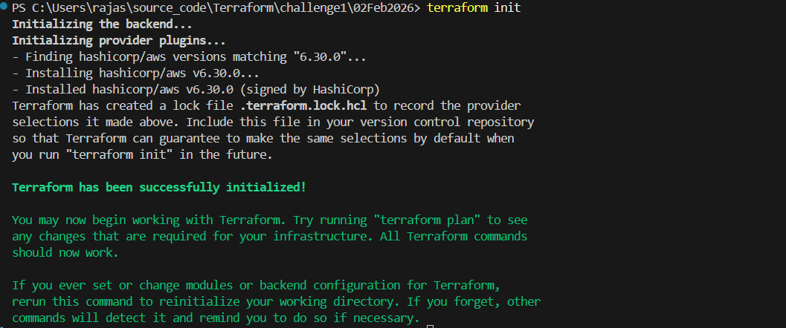
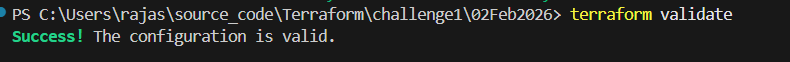
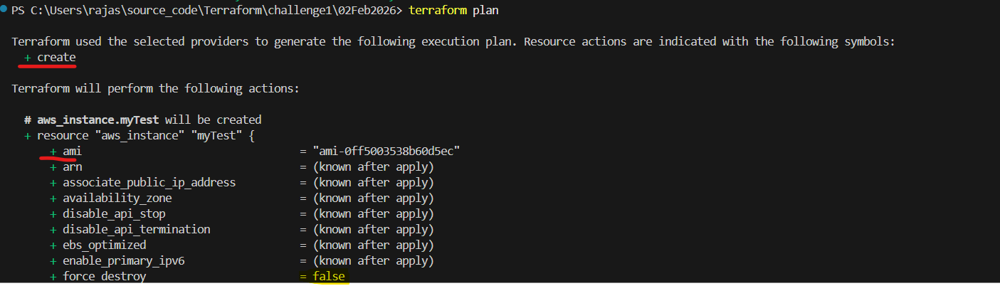
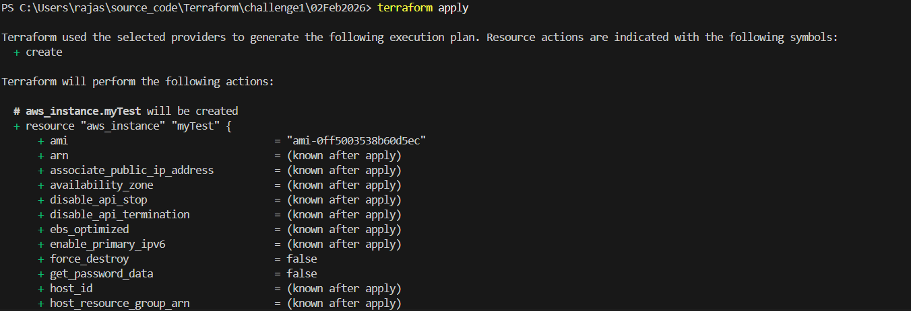
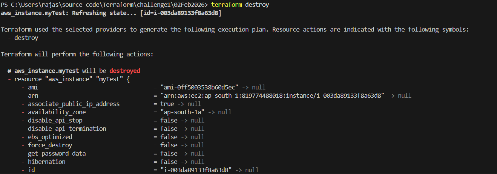

# Terraform Commands Execution

## terraform init
- when we hit the terraform init it will initialize the backed and provider plugins.
- This will creates the **.terraform** folder and **.terraform.loc.hcl** file creates.
- terraform folder contains the licence text file and terrafom provide exe file.
- terraform.lock.hcl file contains the provide aws information like versions, hash codes etc. 



## terraform validate
- This will check the syntax errors. If everything ok then it will show the success.



## terraform plan 
- What will be going to change in service like Creating/Updating/ deleting the instances.



## terraform apply 
- This will show like plan command but in bottom line it will ask like this

```t
Do you want to perform these actions?
  Terraform will perform the actions described above.
  Only 'yes' will be accepted to approve.

  Enter a value:
 ```
 Once we give ```yes``` value then it will display like below.

 ```t
aws_instance.myTest: Creating...
aws_instance.myTest: Still creating... [00m10s elapsed]
aws_instance.myTest: Creation complete after 13s [id=i-003da89133f8a63d8]

Apply complete! Resources: 1 added, 0 changed, 0 destroyed.
```


## terraform destroy 
- whatever created using apply command those will be delete after executing the destroy command.
- here also it will show the what are we going to delete it will show.
- Next, it will ask the confirmation to destroy or not, like apply command.
- Once the value is Yes then it will be destroy everting related to that instance.
